## Hi, I'm Yurii 👋

Backend-focused software engineer based in **Prague, Czechia**, and an MSc Software Engineering student at **CTU in Prague**.

I build asynchronous Python microservices with **gRPC**, **Protobuf** and **RabbitMQ**, and build the matching **Vue.js** UI when a feature needs one. My background in data analytics gives me a strong footing in SQL and working with data.

- 💼 Previously: Software Engineer Intern at **Gen Digital**. I built end-to-end features across 4 microservices of an internal analytics application.
- 🎓 MSc Software Engineering (2025 – present) · BSc Data Analytics (2020 – 2024)
- 🔭 Looking for a **junior backend or full-stack developer** role
- 📫 [yurii.loktionov@proton.me](mailto:yurii.loktionov@proton.me)

### 🛠️ Tech stack

| Area | Tools |
| --- | --- |
| **Backend** | Python · asyncio · Java · gRPC · Protobuf · REST APIs · C++ |
| **Data & messaging** | PostgreSQL · SQL · Redis · RabbitMQ |
| **Frontend** | Vue.js · TypeScript · HTML/CSS · Node.js |
| **Cloud & DevOps** | Docker · Kubernetes · GCP · Terraform · Jenkins · Git |
| **Testing** | pytest · JUnit · mocking · Poetry |

### 📌 Featured projects

  
  

- **Expense Tracker**: a Java/JavaFX desktop app for tracking and charting expenses. It has a layered architecture, JUnit tests for every service and a Jenkins CI/CD pipeline.
- **Task Scheduling Algorithms**: a C++ comparison of 0/1 Knapsack dynamic programming against a greedy heuristic, benchmarked for speed and solution quality.

<b>📊 Data & ML projects</b>

 

  
  
  
  

Also: [Bank Transactions SQL](https://github.com/loktiyur/Bank-Transactions-SQL) · [ARIMA model](https://github.com/loktiyur/Arima-model) · [Cohort analysis](https://github.com/loktiyur/Cohort-analysis) · [Online store analysis](https://github.com/loktiyur/online-store-analysis) · [Gamedev analysis](https://github.com/loktiyur/Gamedev-analysis)

### 📈 GitHub stats

  
  

Cards generated with <a href="https://github.com/anuraghazra/github-readme-stats">github-readme-stats</a>.
